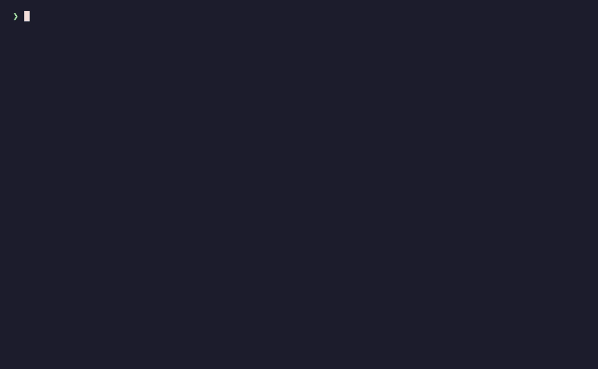

# see

Look at an image without eyes.

`see` gives a text-only model three ways to look at an image: a local ASCII
render for **layout**, the OS text recogniser for **words**, and a vision model
for **understanding**. Only the last one costs an API call.



```bash
see shot.png                                  # ASCII layout, sized to your terminal
see ocr shot.png                              # the text, offline and free
see ask shot.png                              # what it means (vision model)
see caption ./dataset --trigger "ohwx woman" --txt   # bulk-caption a training set
see diagram.png --edges --grid                # structure + citable coordinates
see https://share.safzan.dev/slQAA8YB.webp    # URLs work directly
see ask photo.jpg "what model is the laptop?" # ask a vision model instead
cat shot.png | see - -q > shot.txt            # stdin → file
```

## Install

```bash
bun install
bun link                  # puts `see` on your PATH
# or: bun run build:local # → dist/see, a standalone binary
```

Requires [Bun](https://bun.sh). Decoding is [sharp](https://sharp.pixelplumbing.com)
(PNG, JPEG, WebP, AVIF, GIF, TIFF, SVG).

## What ASCII can and cannot do for a model

An ASCII render carries **layout**: where the panels, columns, boxes and blocks
of text are, and roughly how big. It does not carry **text** — any glyph smaller
than one character cell is averaged into a `:` and is gone for good.

**Braille is worse, not better.** It looks like eight times the detail because a
human eye resolves the dots inside each glyph. A language model does not: `⣿` is
one opaque codepoint, and nothing in the token stream says which of its eight
dots are set. Handing braille to a text model reliably sends it off to write a
decoder and render a PNG — the exact pixel-forensics loop this tool exists to
avoid. `-m braille` is kept for humans looking at a terminal, and `see` warns
when you use it.

So the workflow is:

1. `see info shot.png` — real dimensions.
2. `see shot.png -w 100 --grid` — one cheap pass for layout, with a coordinate
   ruler you can cite ("the button at column 40, row 12").
3. `see ocr shot.png` — pull the words out locally. Free, offline, sub-second.
4. `see ask shot.png` — when you need meaning rather than strings, or when OCR
   comes back empty or mangled.

## Bulk captioning (`see caption`)

For LoRA/training datasets: caption a whole folder into one stem-keyed JSON,
concurrently, and write the `.txt` sidecars kohya and diffusers expect.

```bash
see caption ./dataset --trigger "ohwx woman" --out captions.json --txt
see caption ./dataset --dry-run          # list the work and print the brief, call nothing
see caption ./dataset                    # run it again — only new images cost anything
```

- **Resumes by default.** Stems already in `--out` are skipped, and the file is
  rewritten after *every* image. A crash, a Ctrl-C or a rate limit costs one
  caption, not the run; adding images later costs only the additions.
- **Failures are isolated.** A broken file is reported and left out of the JSON;
  re-running retries exactly those. Rate limits get exponential backoff, and the
  key chain rotates as usual.
- **The default brief captions what VARIES** — clothing, pose, gaze, shot type,
  scene — and explicitly refuses to describe face, hair, build, age or
  ethnicity. Those are constant across a character set, so naming them teaches
  the model words instead of the subject; they belong in the trigger token.
  Replace the whole brief with `--prompt-file`, or add context with `--extra`.
- **Shot-type histogram, free.** Every run prints the distribution and warns
  below ~20 full-body/wide frames, which is roughly where full-body identity
  stops being trainable. Check it *before* paying for a training run.
- Prints `CAPTIONS_WRITTEN <n>` on the last line and exits non-zero if anything
  failed, so a backgrounded run is greppable: `grep -qE "CAPTIONS_WRITTEN [0-9]+"`.

Inputs can be directories, individual files, or a targets `.json`
(`{stem: path}` or `[{stem, path}]`).

## OCR (`see ocr`)

No model, no network, no API key. `see` uses whatever the platform already
ships, and only falls back to Tesseract where there is nothing native:

| platform | backend | install cost |
| --- | --- | --- |
| macOS | Vision.framework (`VNRecognizeTextRequest`) | none — compiles a small cached helper on first run, needs Xcode CLT |
| Windows | `Windows.Media.Ocr` (WinRT, via PowerShell 5.1) | none — built into Windows 10/11 |
| Linux | `tesseract` binary | `apt install tesseract-ocr` |
| anywhere | `tesseract.js` (WASM) | `bun add tesseract.js` — no system deps at all |

Measured on the same 850×928 dark-mode screenshot: Vision 415 ms, Windows OCR
~1 s, `tesseract` 740 ms, `tesseract.js` 2.3 s. Vision and Windows both picked
up a small header line that Tesseract missed.

`see ocr --backends` lists what the current machine can do, best first.
`--backend NAME` forces one; `--lang en-US` (or `eng` for Tesseract) sets the
recognition language.

**OCR gives you strings, not meaning.** It will not tell you which button is
disabled, what a chart implies, or what a photo is of. That is `see ask`.

## Modes

| mode | cell | good for |
| --- | --- | --- |
| `ascii` | 1 sample | layout, diagrams, big shapes — safe for models |
| `braille` | 2×4 samples | human eyes on a terminal; **unreadable to a model** |

Character ramps (`--charset`, or `see charsets`): `ascii`, `dense`, `simple`,
`blocks`, `binary` — or pass your own literal ramp, darkest character first.

Polarity is auto-detected: a dark screenshot with light text is inverted so ink
always renders as dense characters. Override with `--invert` / `--no-invert`.

## Vision-model fallback

This is the part that actually reads an image. `see ask <src> [question]` sends
the bytes to Gemini (`gemini-3.5-flash-lite` by default) and prints prose. With
no question you get a full description plus a verbatim transcript of every
visible string.

`--describe` prints the art *and* the description. A local decode failure falls
back to the model automatically — `--no-fallback` turns that off.

Keys are tried in order and rotated past any that 429s, dies, or gets blocked:

```
--key K1,K2  →  $SEE_API_KEYS  →  $GEMINI_API_KEYS  →  $GEMINI_API_KEY
             →  $GOOGLE_API_KEY  →  ~/.config/see/key
```

No key ships with the source. Get a free one at
[aistudio.google.com/apikey](https://aistudio.google.com/apikey) and either
export it or drop it in the config file:

```bash
mkdir -p ~/.config/see && printf '%s\n' "$YOUR_KEY" > ~/.config/see/key
chmod 600 ~/.config/see/key
```

That file takes a comma- or newline-separated list, so it doubles as your
rotation pool.

If *every* key is out of quota, `see` retries the whole pool once on
`gemini-3.1-flash-lite`, which has its own quota. That only happens for 429/503
— a dead key or a safety block would fail identically on the older model, so it
is not paid for twice. Passing `--model` explicitly disables the swap: an
explicit choice is not one to second-guess.

## Agent skill

`skills/see/SKILL.md` is an [Agent Skill](https://docs.claude.com/en/docs/agents-and-tools/agent-skills)
that teaches a coding agent when to reach for `see` — and, importantly, when not to
(no braille, no reading text off the ramp, no home-grown pixel decoders). Install it by
copying the folder into `~/.claude/skills/`.

## MCP server

Expose the whole thing to an agent as tools — `see_render`, `see_ocr`,
`see_ocr_backends`, `see_caption`, `see_ask`, `see_info`:

```bash
claude mcp add see -- bun run /path/to/see/src/mcp.ts
```

## Flags

```
render
  -w, --width N        output columns (default: terminal width, capped at 200)
  -m, --mode M         ascii | braille
  -c, --charset C      ramp name or a literal ramp
      --invert         force light-on-dark handling
      --no-invert      disable the auto polarity guess
      --color          ANSI truecolor output
      --edges [N]      Sobel edge glyphs above threshold N
      --grid [N]       coordinate ruler every N cells (default 10)
      --crop L,T,W,H   crop in source pixels before scaling
      --aspect R       cell height:width ratio (default 2.1)
      --threshold N    braille ink cutoff 0-255 (default: Otsu)
      --no-normalize   skip contrast stretching
      --bg COLOR       matte behind transparency (default #ffffff)

caption
      --out FILE       stem-keyed JSON output (default captions.json)
      --trigger TOK    LoRA trigger token to prefix every caption
      --txt            also write <stem>.txt beside each image
      --no-resume      re-caption stems already in --out
      --concurrency N  images in flight (default 4)
      --prompt-file F  replace the built-in brief · --extra TEXT appends to it
      --dry-run        list the work and print the brief, call nothing

ocr
      --backend B      vision | windows | tesseract | tesseract.js
      --lang L[,L2]    recognition languages
      --backends       list what this machine can use

vision model
  -a, --ask "Q"        also answer a question about the image
      --describe       also print a full description + transcript
      --no-fallback    fail instead of falling back on a decode error
      --model NAME     vision model
      --key K[,K2]     API key(s); see the key chain above

output
  -o, --out FILE       write to a file instead of stdout
  -q, --quiet          no stderr info header
      --json           emit {text, info, answer} as JSON
```

Art goes to stdout, diagnostics to stderr — `see x.png > art.txt` stays clean.

## Development

```bash
bun test          # unit tests, no network
bun run check     # typecheck + tests
```

MIT licensed.

`ocr.ts` owns every platform backend behind one `ocrImage()` call, and
`caption.ts` the bulk loop (resume, retry, concurrency, histogram).
`render.ts` is pure (samples → lines) and holds every pixel decision.
`image.ts` is the only file that knows about sharp. `core.ts` joins them, and
`cli.ts` / `mcp.ts` are thin frontends over that one `view()` call.
